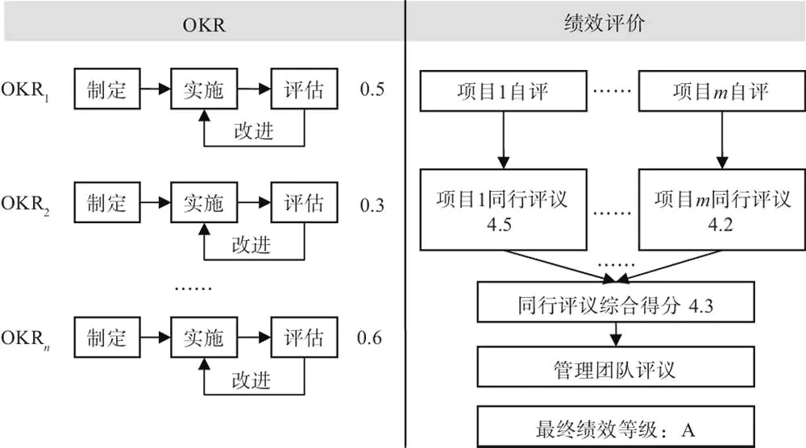

## 1.管理

### 1.1 OKR

目标管理的精髓：
1. 员工和leader共同制定目标，员工对结果负责。
2. 员工在设定目标后自主决定实现的路径和方法，leader人提供必要的资源。
3. leader人在过程中提供辅导，帮助和监控，不能撒手不管。

#### 1.1.1 基础理解

OKR全称是Objectives & Key Results，即目标与关键成果
- O = Objective 可以理解为企业目标
- KR ＝Key Results 可以理解为关键结果
- 浓缩在一起就是“为确保达成企业目标的关键结果分解与实施”

1. OKR是企业进行目标管理的一个简单有效的系统，能够将目标管理自上而下贯穿到基层。对一个项目来说，设定目标是非常重要的，因为这决定了如何去做，以及能做到何种程度。
2. OKR 首先是沟通工具：团队中的每个人都要写 OKR，所有这些OKR都会放在一个文档里。任何员工都可以看到每个人在这个季度最重要的目标是什么，团队这个季度的目标是什么。
3. OKR是努力的方向和目标：OKR代表你到底要去哪里，而不是你要去的地方具体在哪里。
4. OKR必须可量化（时间和数量）。比如健身时设定锻炼目标，如果只是定义成「我们要努力提高身体素质」，肯定不是一个好的 OKR，因为无法衡量，好的OKR是「今年的跑步时间较去年增加一倍」。
5. 目标必须一致：制定者和执行者目标一致、团队和个人的目标一致。首先，制定公司的OKR；其次，每个团队定自己的 OKR；第三，每个工程师或设计师写各自的OKR。这三步各自独立完成，然后对照协调这三者的OKR。OKR跟个人绩效没有关系，因为OKR 系统的结果和每个人并不直接挂钩。
6. 目标要是有野心的，有一些挑战的，有些让你不舒服的。一般来说，“最佳”的 OKR 分数在0.6-0.7之间，如果某人只拿到1分，那么他 OKR 订的目标显然是野心不够的。但是低分数的人也不应该受到指责，而是应通过看他工作上的数据，帮助他改进下一季度的 OKR 目标。
7. 通过月度会议Review ，时时跟进OKR：在月度会议上需要确定如何去达到目标，是一个帮助达到目标的过程。
8. 通过季度会议Review ，及时调整OKR：互联网的变化非常快，每季度有一个OKR 的 review，调整的原则是目标（Objectives）不变，只允许调整关键成果（Key Results）。

#### 1.1.2 文化背景

1. 模糊的目标，用于统一努力的方向，而非计划
    - OKR不是计划，只是一个模糊的目标和实现方向，具体如何实现还需要由成员一起探索.
2. 目标量化
3. 基础目标由员工或者Tech Lead提出，而非中高层经理
4. 制定OKR是为了激发和释放员工的内在潜力，鼓励他们敢于挑战自我，而不是为了绩效评价
5. 不作为直接考核标准(OKR进度跟个人绩效没有直接关系)
    - OKR自评和绩效评价是两套独立的评价系统
    - OKR得分无关绩效评价,只是反映了OKR的进展信息

- 绩效评价流程
    1. 开展绩效评价时，出发点是员工自评，这里评的是员工的最终贡献(只需要简要列出自己在考评周期内实际有哪些产出即可)
    2. 提交同行进行评议，针对每个项目，相关同行都会给出一个评分(OKR+360)
    3. 管理团队会结合同行评议结果给出员工的最终评价结果，对员工在考评周期内的贡献进行定性

制定一个有挑战的，哪怕最终没能100%完成的目标对绩效的牵引作用，远大于制定一个容易的、可完满完成的目标对绩效的牵引作用。

#### 1.1.3 执行思想

1. 公司：OKR 是管理层向整个公司表达近期想要着重做的事情？是开拓新的领域还是深耕现有领土？
2. 团队：OKR 是团队 Leader 首先需要考虑为了公司的 OKR，自己的团队能为了做什么；除此之外本团队想做的紧急而重要的事情；
3. 个人： OKR 除了绑定公司和团队的 OKR，自己还想改变和挑战什么，为什么？

---
1. 自上而下：公司和团队的 leader 需要明确自己想要的 O 是什么？更重要的是为什么有这个 O？然后是各项优先级，至于 KR 可以多种多样；
2. 需要遵循SMART原则：任何一个同学都能看懂你的 OKR，特别是跨部门的同学；
    - 具体的
    - 可以衡量的
    - 可以达到的
    - 相关的
    - 有时间限制的
3. 强调产出(Key Results) : 所谓产出导向就是关注做事情的成果，而不仅仅关注事情做了没有；
4. 及时调整：定期排序，调整优先级。
---
1. OKR 公开之后，每个团队和个人都能清楚伙伴们在做什么，避免浪费，借力合作。
2. 每个人的精力是有限的，对应到团队和公司也一样；OKR 更多会是作为一个管理方法或者沟通的工具，经常打开 OKR 看看，让大家的努力都在一定时间内专注在一致的方向上。
---
1. 绑定到公司、部门的OKR，对应于她的 JD ，她需要做什么？
2. 除此之外，还有什么是部门、个人迫切想改变和挑战的？比如科学的评价体系、如何提升效率。
---
1. 设定一个“目标”（Objective），这个目标务必是确切的、可衡量的，例如不能说笼统地说“我想让我的网站更好”，而是要提出诸如“让网站速度加快30%”或者“融入度提升15%”之类的具体目标
2. 设定若干可以量化的“关键结果”（Key Results），用来帮助自己实现目标。

#### 1.1.4 KPI&OKR差异
1. KPI是结果，OKR是某种路径
2. 常规公司都是KPI与OKR并存(KPI是人力的事，业务线不用太关注，而OKR是业务的事，人力不用太关注。)

案例对比:
- 某某公司CEO岗位的2019年KPI 
1. 利润额增长 30%/25%/20% 
2. 利润率提高 25%/20%/15%
- 他的OKR中就不要提到KPI中的利润额了。 
1. O：以创新思维或方法来进行营收破局 
2. KR1：增值服务收入达到300亿 
3. KR2：年收入增长300%的A岗人数达到50% 
4. KR3：诞生10个利润率达到50%以上的创新产品 
5. KR4：开辟3个我们从未取得收入的商业模式 
6. KR5：全员OKR

