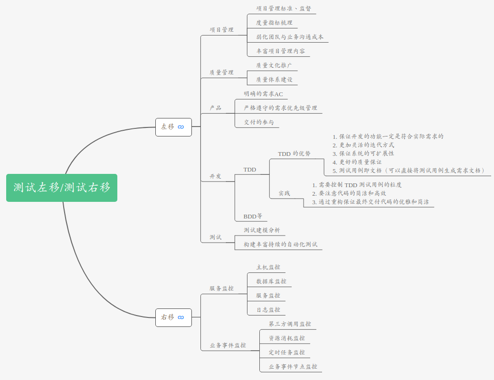
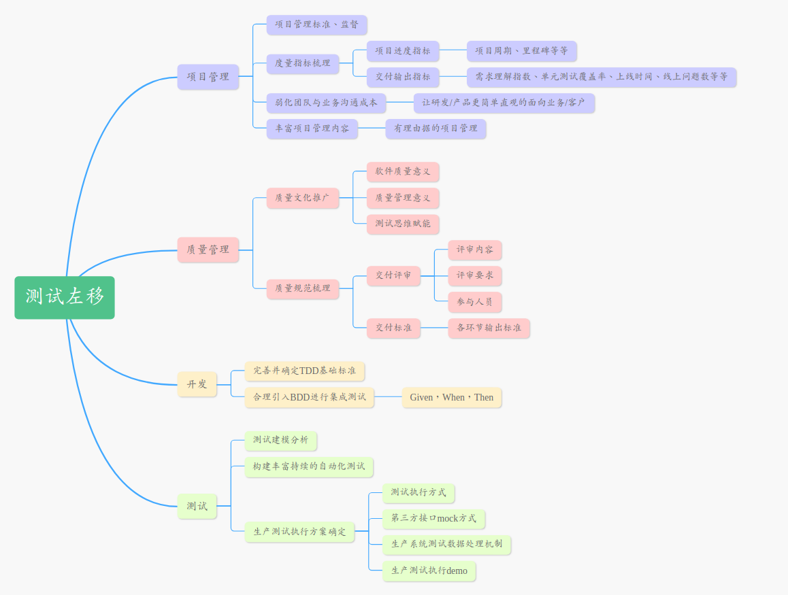

## 1. 左移&右移

### 1. 左移
- 左移：通过对代码的静态扫描，安全扫描，组织评审等方式，提前解决一些可能的代码质量问题,缩短测试的周期。1.提高质量上限 2.提高质量下限.围绕质量服务思想展开,主要关注于质量问题，参与人员则不仅仅局限于测试人员. 对于测试左移的落实，最重要的就是全员质量服务意识的培养

### 2. 右移
- 右移：通过对测试环境（开发环境、生产环境或许也有）的管理和质量维度的监控，实现上线前、上线后的质量保证。这里其实一般的测试主要是保证测试环境的质量。但是我觉得，对生产环境的质量监控是非常重要的，这是测试了解生产真实情况的最佳途径。右移我认为也不是抢运维的饭碗，也是对产品质量的保证补充。

### 3. 总结
1. 传统以往的研发和运维体系，其实是缺失了这一部分的质量保证。研发没有从代码层面监控质量，运维没有从生产上监控软件质量。以前的运维，只要服务器不出问题，软件正常跑，其他就不管了。
2. 现在微服务的发展，需要非常细的颗粒度去监控整个软件的运行，所以有了全链路追踪。全链路追踪这里可以认为是运维应该做的，也可以认为测试应该做的，因为测试的职责是把控质量，而链路追踪恰巧可以给测试了解到软件运行过程中非常多的质量问题，这也是以前没有的。所以现在很多公司是测试在做这块，运维没啥动力。
3. 每家公司的情况都有很大的不同，有的公司可能开发规范，开发自然而然的就把我们需要左移的事情都做了，那测试就可以作为质量监督者把控下即可。如果是公司没有，那么测试做，可以提高自己。运维的活同理。
4. 其实作为测试，我觉得无论如何，首先要准确的认识到自己做的事情是为了什么。无论是左移还是右移，目的都在于更好的产品质量。我们用的所有手段，所有技术，都是为了提高测试过程中的效率，准确判断产品质量问题。如果偏移了这个中心，那么我觉得测试就不再是测试了。

### 有哪些活动可以提高质量上限（举例）

- 健康的项目流程（合理并且严格遵守的项目流程）
- 合理的需求分析（评估需求的质量，分析需求的合理性以及完整性）
- 出色的系统架构
- 完整的系统设计（评估设计的质量，分析需求的合理性以及完整性）
- 充分利用静态代码扫描
- 进行研发标准的定义
- 更早的测试分析（先于开发完成需求的分析，做好各种评审的准备）
- 尽早的测试执行（提早参与测试执行，在集成前就发现一些问题）

### 有哪些活动可以提高质量下限（举例）

- 健康的测试流程
- 优秀的测试用例
- 合理的测试计划
- 合适的自动化
- 适当的探索式测试
- 开发自测（TDD、BDD，测试提供更好的用例、技术支持）
- 团队质量意识的培养

## 2. 敏捷测试
敏捷测试就是符合敏捷宣言思想，遵守敏捷开发原则，在敏捷开发环境下能够很好地和其整体开发流程融合的一系列的测试实践，这些实践具有鲜明的敏捷开发的特征，如TDD、ATDD、结对编程、持续测试等。和传统测试的区分，可以概括如下：

1. 传统测试更强调测试的独立性，将“开发人员”和“测试人员”角色分得比较清楚。而敏捷测试可以有专职的测试人员，也可以是全民测试，即在敏捷测试中，可以没有“测试人员”角色，强调整个团队对测试负责。

2. 传统测试更具有阶段性，从需求评审、设计评审、单元测试到集成测试、系统测试等，从测试计划、测试设计再到测试执行、测试报告等，但敏捷测试更强调持续测试、持续的质量反馈，阶段性比较模糊。

3. 传统测试强调测试的计划性，认为没有良好的测试计划和不按计划执行，测试就难以控制和管理，而敏捷测试更强调测试的速度和适应性，侧重计划的不断调整以适应需求的变化。

4. 传统测试强调测试是由“验证”和“确认”两种活动构成的，而敏捷测试没有这种区分，始终以用户需求为中心，每时每刻不离用户需求，将验证和确认统一起来。

5. 传统测试强调任何发现的缺陷要记录下来，以便进行缺陷根本原因分析，达到缺陷预防的目的，并强调缺陷跟踪和处理的流程，区分测试人员和开发人员的各自不同的责任。而敏捷测试强调面对面的沟通、协作，强调团队的责任，不太关注对缺陷的记录与跟踪。

6. 传统测试更关注缺陷，围绕缺陷开展一系列的活动，如缺陷跟踪、缺陷度量、缺陷分析、缺陷报告质量检查等，而敏捷测试更关注产品本身，关注可以交付的客户价值。在快速交付的敏捷开发模式下，缺陷修复的成本很低。

7. 传统测试鼓励自动化测试，但自动化测试的成功与否对测试没有致命的影响，但敏捷测试的基础就是自动化测试，敏捷测试是具有良好的自动化测试框架支撑的快速测试。

## 3. 质量管理

首先需要理解不论是敏捷开发还是瀑布开发，质量都是一个研发团队需要关注的，质量管理也都是要进行的。任何一个不关注质量的团队，是没办法长期发展的。

### 1.敏捷开发与质量管理的关系
* 敏捷开发关注敏捷，快速响应变化，减少互联网发展带来的影响;
* 质量管理关注质量，确保产品质量，带来长期效益。

两者表面看起来是没有什么关联关系的，但是其实两者之间是一个互补的关系。质量管理为敏捷开发提供敏捷基础，敏捷开发为质量管理提供文化传播。怎么理解？
1. 敏捷开发关注快速响应，但是长久的敏捷才是真正的敏捷！

如果为了实现敏捷闷头迭代向前冲刺，一段时间之后就会发现有很多瓶颈。例如：新类型的需求系统架构不支持，需要系统重构;为了快速响应、迭代上线，开发忽略了单元测试、测试忽略覆盖率，线上问题很多。质量管理就是为敏捷开发提供基石，让敏捷开发长期的快速前进。
2. 质量管理的重心思想是**消灭质量部门，将质量变为所有人关注的问题**。

### 2.敏捷开发中如何做质量管理
上面提到质量管理4.0的时代已经开始，需要将敏捷开发与质量管理4.0结合
这里我想起之前整理’测试左移‘时的两点“质量上限、质量下限”

如果将敏捷开发看作“车”，质量管理看作“路”，那么团队要做得事情就是”把车开到目的地“
1. 确定并遵守质量下限
    明确质量下限就意味着，无论事情做得多糟糕只要满足质量下限，就可以认为产品是合格的。
    跟敏捷开发结合起来就是，严格遵守质量下限的基础上快速响应，即提高了响应效率又保证合格的质量。就像只要“路”存在，“车”就可以跑起来。
2. 不断挑战质量上限
    挑战质量上线，就是通过更好的方式让产品的质量输出更好
    跟敏捷开发结合起来就是，提高质量上限就像把“石路”变成“柏油路”再变成“高速路”，这样“车”就可以换成“跑车”，让敏捷变得更敏捷。
3. 质量管理不要成为敏捷开发的累赘
    为特定的“车”提供合适的“路”即可。团队的精力是有限的，既要“开车”又要“修路”，当”车“还是”奥拓“的时候没有必要为他修一条”高速公路“，如果把精力全部放在”修路“上反而没有精力去”开车“，毕竟”车到达目的地“才是重点
4. 敏捷团队的所有人都要参与质量管理
    ”车“和”路“都有了，但是把“车”开到”目的地“还早，小心“路上有坑”！
    敏捷开发提供了快速的工具，但是它毕竟只是工具，真正的完成目标还需要注意过程。

### 3 敏捷开发中质量人员的角色分配
**传统质量管理角色（QC、QA和QM）**

根据质量管理4.0的终极目标“消灭质量部门”，是不再需要质量人员的。

但是实现这个终极目标是需要进行很大的前期工作的，所以QM、QA、QC人员在这个阶段仍然是不可或缺甚至说很重要的，他们需要向着“消灭自己”持续奋斗

* QM职在建立敏捷质量体系，需要真正理解质量管理、敏捷开发，定义质量体系结构。必要时QM可以扩充为一个组织（包括boss、总监、各级主管）

* 跟质量上限是一样的道理，QA人员通过质量文化传播、不断改进等方式为团队带来**质量上线**的不断提升。

* 同样QC人员通过功能测试、探索测试等方式为团队提供**质量下限**

其实敏捷开发中的质量人员角色，相较于上图的角色定位都向前迈出了半步。QC需要做一些QA的工作，QA需要掌握QM的基础，QM由部门走向全员组织。而最基础的QC检验即将被淘汰，所以说敏捷开发中
* 如果你将自己钉在 传统QC的位置上，基本上死定了。
* 如果你将自己盯在 QA，那么可以提升自己的系统思维方

## 4. 探索性测试

1. 自由式探索式测试
自由式探索式测试指的是对一个应用程序的所有功能，以任意次序、使用任何如数进行随机探测，而不考虑哪些功能是否必须包括在内。自由式测试没有任何规则和模式、只是不停的去做。很不幸，很多人认为所有的探索式测试都是自由式的，从长远的观点来看，这种看法低估了探索式测试技术的能力，我们在随后将看到这类测试的一些变种。
一个自由测试用例可能会被选中成为一个快速的冒烟测试，用它来检查是否会找到重大的崩溃或者严重的软件缺陷，或是在采用先进的技术之前通过它来熟悉一个应用程序。显然，自由式探索式测试无需也不应该进行大量的准备规则。事实上，它更像是“探索”而不是“测试”，所以我们应当相应的调整对它的期望值。
自由式测试不需要多少经验或者信息。但是，同以下提到的探索式技术相结合后，它将成为一个非常强大的测试工具。
2. 基于场景的探索式测试
基于场景的探索式测试和传统的基于场景的测试有类似之处。两者都涉及到一个开始点，就是用户故事或者是文档化的端到端场景的开始之处，那也是我们所期望的最终用户开始执行应用程序的地方。这些场景可以来自用户研究、应用程序、以前版本的数据等，并作为脚本用于测试软件。探索式测试是对传统场景测试的补充，把脚本的应用范围扩大到了更改、调整和改变用户执行路径的范畴。
使用场景作为指导的探索式测试人员经常会修改他感兴趣的输入或者是追寻一些并没有包括在脚本中的潜在副作用。不过，由于最终的目标是完成给出的场景，这些测试上的弯路、最终总是会回到脚本文件记载的用户主要执行路径。
3. 基于策略的探索式测试
将自由式测试探索式与具有测试老手的经验、技能和感知融合在一起，就成为基于策略的探索式测试。它属于自由式的探索，只是他是在现有的错误搜索技术下引导完成的。基于策略的探索式测试应用所有的已知技术(如边界值分析或组合测试)和未知的本能(如异常处理往往容易出现软件缺陷)，来指导测试人员进行测试。
这些已知的策略是基于策略的探索式测试成功的关键，存储的测试知识越丰富，测试就会更有效率。这些策略缘于积累下来的知识，它们指导软件缺陷隐藏在哪里，如何综合人工输入数据，那些代码路径常常出现故障。
基于策略的探索式测试结合了测试老手的经验和探索型测试人员的随机性。
4. 基于反馈的探索式测试
基于反馈的探索式测试缘于自由式测试，但是随着测试历史的形成，测试人员们就会利用反馈来指导今后的探索。“覆盖”就是典型的例子。一名测试人员通过咨询那些覆盖指标(代码覆盖、用户界面覆盖、特性覆盖、输入覆盖或者其中的某一些组合)来选中新的测试用例，以使这些覆盖指标得以提高。覆盖指标只是收录反馈信息的标志之一。我们也会看其他标志，如代码改动数量和软件缺陷密集程度等。
基于反馈的探索式测试时一种“上一次测试”：在上一次我根据应用程序的最后状态选了每某一个输入之后、下一次我就会选中另外一个输入。或者是，在上一次遇到这个界面时我用A属性，这一次我就会用B属性。
基于反馈的探索式测试工具是非常有价值的，它可以是测试人员保存、搜索测试历史并据此采取实时行动。不幸的是这样的工具很少。