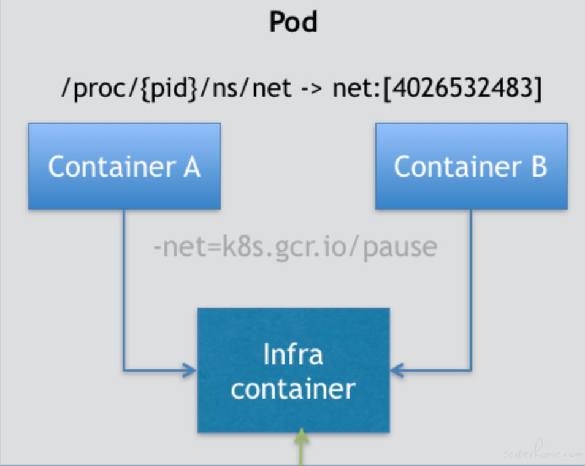

https://testerhome.com/articles/17752

- Pod是一个逻辑概念,是一组共享了某些资源的容器
- Pod 里的所有容器，共享的是同一个Network Namespace，并且可以声明共享同一个Volume
- POD是k8s调度的最小逻辑单位，一个POD中的所有容器都必须被调度到同一台机器上

## 网络模式



infra container，它也叫做pause容器，也被称为sandbox,这个沙箱为其他容器提供共享的网络和文件挂载资源.它的逻辑跟docker中container网络模式的逻辑一样.当这个容器被创建出来并hold住Network Namespace之后，其他由用户自己定义的容器就可以通过container模式加入到这个容器的Network Namespace中,这也就意味着，对于在一个POD中的容器A和容器B来说，他们拥有相同的IP地址，可以通过localhost进行互相通信

## sidecar模式

在宿主机上开辟出一个空目录，然后把这个目录地址挂载到pod中的各个容器中就可以了。 而在k8s为POD做的声明式API中，专门有一个empty dir的volume类型。 就是专门在POD中开辟一个临时的可共享的空目录。这样在一个POD中的多个容器就可以通过这个目录进行文件的共享。 一个典型的例子就是日志收集。 在我们的产品之前的部署方式中，就是使用这种方式来做日志收集的。 在一个pod中启动一个服务容器，然后再启动一个filebeat容器，这两个容器通过这个 empty dir 共享了日志的目录。 服务容器把日志写到这个目录中， filebeat容器就可以同步的收集这些日志并发送到ES中

sidecar 指的就是我们可以在一个 Pod 中，启动一个辅助容器，来完成一些独立于主进程（主容器）之外的工作。 同时我们有时候也会叫它伴生容器，因为往往它与主容器伴生伴死。 这种sidecar模式有一个缺点就是由于这种伴生伴死的特性来的。 如果辅助容器出现了以外，比如oom，或者用来做健康检查的探针探测失败。 在POD层面都会触发重启，那么在重启结束前会导致主容器的不可用


```yaml
apiVersion: v1
kind: Pod
metadata:
    name: javaweb-2
spec:
	initContainers:
	-	image: geektime/sample:v2
    	name: war
        command: ["cp", "/sample.war", " / app"]
		volumeMounts:
        -   mountPath: /app
            name: app-volume
	containers:
	-	image: geektime/tomcat:7.0
		name : tomcat
        command: ["sh", "-C", "/root/apache-tomcat-7.0.42-v2/bin/start.sh"]
		volumeMounts:
		-   mountPath: /root/apache-tomcat-7.0.42-v2/webapps
		name: app-volume
		ports:
		-   containerPort: 8080
			hostPort : 8001
	volumes
    -   name: app-volume
		    emptyDir: {}
```

## label

`kubectl label nodes qa-test001 env=test`: 向qa-test001这个节点打上env=test的标签

部署POD的时候selector会部署在含有指定label的node

```yaml
apiVersion: v1
kind: Pod
metadata:
  name: test
  labels:
    run: test
spec:
      nodeSelector:
         env: test
      containers:
      - name: selenium-node-chrome
        image: registry.4paradigm.com/chrome_debug
        imagePullPolicy: IfNotPresent
        ports:
          - containerPort: 5900
        env:
          - name: HUB_PORT_4444_TCP_ADDR
            value: "selenium-hub"
          - name: HUB_PORT_4444_TCP_PORT
            value: "4444"
          - name: NODE_MAX_INSTANCES
            value: "30"
          - name: NODE_MAX_SESSION
            value: "30"
          - name: NODE_REGISTER_CYCLE
            value: "5000"
          - name: DBUS_SESSION_BUS_ADDRESS
            value: "/dev/null"
```

- image: registry.4paradigm.com/chrome_debug来指定容器使用的镜像。
- imagePullPolicy 则定义了我们更新镜像的策略。 这里一共我们有3个选择，一个是always(不管什么情况只要启动容器就尝试拉取镜像，如果节点中有镜像会覆盖)，一个是Nerver(不论如何都不拉取镜像，如果节点上没有镜像会抛出错误)以及我们这里使用的IfNotPresent(如果节点中存在此镜像就不再拉取，如果不存在就拉取)。
- ports：定义容器对外暴露的端口号
- env：定义为容器指定的环境变量

## Pod
### restartPolicy
针对服务要支持高可用，灾难恢复，负载均衡等功能,K8S提供了诸如Deployment，Service等资源对象来协助POD完成这些设计.但是也需要POD本身拥有一些机制,restartPolicy就是其中之一。这个功能就是 Kubernetes 里的Pod 恢复机制。它是 Pod 的 Spec 部分的一个标准字段，默认值是Always，意思是不论任何时候POD出现了异常，都一定会重新创建。当然用户还可以手动指定这个重启的策略

- Always： 不论任何时候，只要k8s检测到POD不在运行状态，都会尝试重新创建它。
- OnFailure：只要在POD中的容器出现异常时才重启容器， 如果容器是处于complete状态，也就是正常退出的状态，是不会重启的
- Nerver：从来不重启容器。

tips：如果POD中存在多个容器(不包括pause容器)，那么只有所有容器都都进入异常状态后，POD的状态才会是Failure，否则仍然是running状态。


我们需要根据自己的业务形态来合理的设置这个值， 
- 如果我们的容器是一个在线的服务，那么可能设置为默认的Always是比较合理的，因为我们期望它能够在异常的时候自动重启来保持服务状态， 
- 当然如果我们是在测试环境中，可能希望这个值是Nerver比较好， 因为有些时候我们希望能保留现场。 
- 而如果是离线的task，比如运行一个测试任务，那么设置为OnFailure是比较合理的，也就是只有在出现异常的时候才会重跑任务，而程序正常退出处于complete状态的时候，是不会触发重启策略的。


### 探针
比如OOM或者容器内1号进程异常退出。面对这种异常我们是不需要增加任何机制k8s就能检测到并根据restartPolicy进行重启。但是我们面对的大多数情况都是k8s无法自动检测出的异常。比如容器内进程仍然存在，但是已经因为一些异常无法对外正常提供服务了。 所以为了解决这种健康检查问题，k8s为我们提供了两种探针：`livenessProbe`和`readnessProbe`

readnessProbe：用来探后容器启动后服务是否达到ready状态，k8s一旦探测到容器中的服务在启动后达到了可以对外服务的状态，就会将POD设置为Running状态，从此这个探针就会失效。 而如果在探针有效期内容器中的服务一直没有处于ready状态，就会把POD标记为异常状态并触发POD的restartPolicy
livenessProbe：在容器启动后，周期性的持续对容器中的服务进行探活，如果发现容器内的服务处于异常状态，就会将POD标记为异常状态并触发POD的restartPolicy