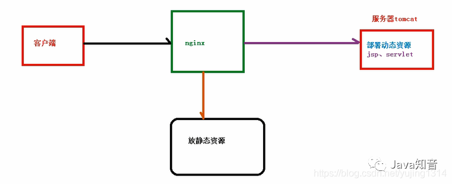

## 1. 简介

### 1.1 特点:
1. 处理响应请求很快
2. 高并发连接
3. 低的内存消耗
4. 具有很高的可靠性
5. 高扩展性
6. 热部署
7. 自由的 BSD 许可协议

### 1.2 作用
1.负载均衡，nginx占用80端口，g可以占用多个非80端口;
2.拦截静态请求;
3.伪静态化并缓存，减少动态请求数量;
4.依赖于nginx强大的功能和性能，可以做访问控制，限速，限连接数等等;

## 2. 参考资料
- 官方文档: https://www.nginx.cn/doc/index.html
- w3c: https://www.w3cschool.cn/nginx/ycn81k97.html

## 3. 命令
- 查看版本: `nginx -v`
- 启动服务: `nginx`
- 快速关闭: `nginx -s stop` 不管有没有正在处理的请求
- 优雅关闭: `nginx -s quit` 退出前完成已经接受的连接请求
- 重新加载: `nginx -s reload`
- docker运行: `docker run -d -v $PWD/nginx/html/:/usr/share/nginx/html/ -v $PWD/nginx/conf/nginx.conf:/etc/nginx/nginx.conf -v $PWD/nginx/log/:/var/log/nginx/ --name mynginx -p 5555:80 nginx:latest`
    1. 如没配置文件等 需要在非挂载的情况下构建 然后去容器内获取配置文件 再次按上面进行构建
    2. 如有配置文件 可直接执行

## 4. nginx 基础知识

- html文件夹: `/usr/share/nginx/html/`
- conf文件: `/etc/nginx/nginx.conf`
- log文件夹: `/var/log/nginx/`

### 4.2 配置示例
- nginx配置Example:

```nginx
user  nginx;
worker_processes  1;  # 表示工作进程的数量

error_log  /var/log/nginx/error.log warn;
pid        /var/run/nginx.pid;


events {
    worker_connections  1024;  # 表示每个工作进程的最大连接数
}


http {
    include       /etc/nginx/mime.types;
    default_type  application/octet-stream;

    log_format  main  '$remote_addr - $remote_user [$time_local] "$request" '
                      '$status $body_bytes_sent "$http_referer" '
                      '"$http_user_agent" "$http_x_forwarded_for"';

    access_log  /var/log/nginx/access.log  main;

    sendfile        on;
    #tcp_nopush     on;

    keepalive_timeout  65;

    #gzip  on;

    include /etc/nginx/conf.d/*.conf;
}
```

- nginx子配置Example：`/etc/nginx/conf.d/default.conf`

```nginx
server {  # 块定义了虚拟主机
    listen       80;  # 监听端口
    listen  [::]:80;
    server_name  localhost;  # server_name


    location / {
        root   /usr/share/nginx/html;
        index  index.html index.htm;
    }

    #error_page  404              /404.html;

    # redirect server error pages to the static page /50x.html
    #
    error_page   500 502 503 504  /50x.html;
    location = /50x.html {
        root   /usr/share/nginx/html;
    }
}
```


### 4.3 配置语法

#### 1. 全局块
未被花括号包围的皆为全局块
- `worker_process`: 表示工作进程的数量，一般设置为cpu的核数

#### 2. events块
- `worker_connections`: 表示每个工作进程的最大连接数

#### 3. http块

- `server{}`: 块定义了虚拟主机
- `listen`: 监听端口
- `server_name `: 监听域名
- `location {}`: 是用来为匹配的 URI 进行配置，URI 即语法中的“/uri/”
- `location /{}`: 匹配任何查询，因为所有请求都以 / 开头
- `root`: 指定对应uri的资源查找路径,完整路径: root+location
- `alias`: 指定对应uri的资源查找路径,相对路径: (alias=location)+剩下uri
- `index `: 指定首页index文件的名称，可以配置多个，以空格分开。如有多个，按配置顺序查找。


### 4.4 路径(location)匹配规则:

|语法|释义|
|-|-|
|location = /uri|= 表示精确匹配，只有完全匹配上才能生效|
|location ^~ /uri|^~ 开头对URL路径进行前缀匹配，并且在正则之前。|
|location ~ pattern|开头表示区分大小写的正则匹配|
|location ~* pattern|开头表示不区分大小写的正则匹配|
|location /uri|不带任何修饰符，也表示前缀匹配，但是在正则匹配之后|
|location /|通用匹配，任何未匹配到其它location的请求都会匹配到，相当于switch中的default|

1. nginx 路径匹配有四个级别(精准匹配>开头匹配>正则表达式>普通>通用)
2. 同级别的使用匹配程度最高的
3. 同级别匹配程度相同的使用最上面的


```nginx

# 最高级（精准匹配）

location = /a {
    echo "= /a";
}

# 次级（开头匹配）
location ^~ /a {
    echo "^~ /a";
}

# 三级（正则表达式）
location /w {
    echo "regular /w";
}

# 最低级
location /b {
    echo "/b";
}

```

## 5. 反向代理


反向代理：客户端无法感知代理，因为客户端访问网络不需要配置，只要把请求发送到反向代理服务器，由反向代理服务器去选择目标服务器获取数据，然后再返回到客户端，此时反向代理服务器和目标服务器对外就是一个服务器，暴露的是代理服务器地址，隐藏了真实服务器IP地址


### 1. 模板
将根目录代理到目标地址

```nginx
# --------------------------------------
# 访问/ 相当于 访问 URL
location / {
    proxy_pass URL;
}

# --------------------------------------
# 访问/a 相当于 访问 URL/a
location /a {
    proxy_pass URL;
}

# --------------------------------------
# 访问/b 相当于访问 URL
location /b/ {
    proxy_pass URL/;
}

```

## 6. 负载均衡(load balance)


### 1. 模板

```nginx
http {
    upstream group1 {
        server IP1 weight 2;
        server IP2 weight 1;
    }
    server {
        location /g {
            proxy_pass http://group1/;
        }
    }
}
```

### 2. 负载均衡方式
1. weight：权重越高优先级越高
2. fair: 按后端服务器的响应时间来分配请求，相应时间短的优先分配

```nginx
    upstream group1 {
        server IP1;
        server IP2;
        fair;
    }
```
3. ip_hash: 每个请求按照访问ip的hash结果分配，这样每一个访客固定的访问一个后端服务器，可以解决session校验的问题

```nginx
    upstream group1 {
        server IP1;
        server IP2;
        ip_hash;
    }
```

## 7. 动静分离


动静分离： 把动态请求和静态请求分开，不是讲动态页面和静态页面物理分离，可以理解为nginx处理静态页面，web服务器负责动态页面

动静分离大致分为两种：
1. 纯粹将静态文件独立成单独域名放在独立的服务器上，也是目前主流方案；
2. 将动态跟静态文件混合在一起发布，通过nginx分开

## 8. 高可用(暂不详细研究)


- 两台服务器
- 安装keepalived
- 虚拟ip
