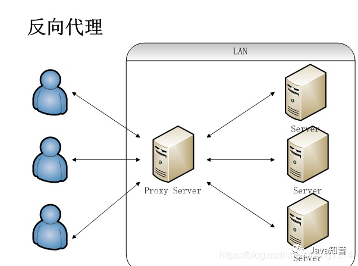

## 1. 简介
nginx是一个高性能的HTTP和反向代理WEB服务器
### 1.1 特性
1. 处理响应请求很快
    - 采用 master-slave 模型
2. 高并发连接
    - 支持高达 50,000 个并发连接数
3. 低的内存消耗
4. 具有很高的可靠性
    - 采取了分阶段资源分配技术，使得它的 CPU 与内存占用率非常低
5. 高扩展性
6. 热部署
    - 不间断服务的情况下进行升级
7. 自由的 BSD 许可协议

### 1.2 功能
1. 负载均衡
2. 反向代理
3. 动静分离
4. 伪静态化并缓存，减少动态请求数量;
5. 依赖于nginx强大的功能和性能，可以做访问控制，限速，限连接数等等;

### 1.3 参考资料
- 官方文档: https://www.nginx.cn/doc/index.html
- w3c: https://www.w3cschool.cn/nginx/ycn81k97.html
- https://www.bilibili.com/video/BV1zJ411w7SV

## 2. 架构设计


### 设计架构
- nginx启动后默认以daemon在后台运行,包含一个 master 进程和多个 worker 进程
- master 进程主要用来管理 worker 进程
    - 接收来自外界的信号
    - 向各 worker 进程发送信号
    - 监控 worker 进程的运行状态
    - 当 worker 进程退出后(异常情况下)，会自动重新启动新的 worker 进程
- worker 进程 处理基本网络事件
    - 多个 worker 进程之间是对等的
    - 各进程互相之间是独立的
    - worker 进程的个数一般与机器cpu核数一致

### 请求处理逻辑
1. master 进程中，建立好需要 listen 的 socket（listenfd）
2. master fork 出多个 worker 进程
3. worker 进程的 listenfd 会在新连接到来时变得可读
4. 所有 worker 进程在注册 listenfd 读事件前抢 accept_mutex(互斥锁)
5. 抢到互斥锁的那个worker注册 listenfd 读事件
6. 在读事件里调用 accept 接受该连接。
7. 当一个 worker 进程在 accept 这个连接之后，就开始读取请求，解析请求，处理请求，产生数据后，再返回给客户端，最后才断开连接，进行一个完整的请求流程


### 优雅重启/关闭
`nginx -s reload`:重启逻辑
1. 接到信号后, 重新加载配置文件
2. 再启动新的 worker 进程
3. 向所有老的 worker 进程发送信号, 进行优雅关闭(在收到来自 master 的信号后，就不再接收新的请求，并且在当前进程中的所有未处理完的请求处理完成后，再退出)
4. 新的 worker 在启动后，就开始接收新的请求
5. 老的 worker 

### docker部署
- `docker run -d -v $PWD/nginx/html/:/usr/share/nginx/html/ -v $PWD/nginx/conf/nginx.conf:/etc/nginx/nginx.conf -v $PWD/nginx/log/:/var/log/nginx/ -e TZ="Asia/Shanghai" --name mynginx -p 5555:80 nginx:latest`
    1. 如没配置文件等 需要在非挂载的情况下构建 然后去容器内获取配置文件 再次按上面进行构建
    2. 如有配置文件 可直接执行

## 3. 常用命令
- 查看版本: `nginx -v`
- 启动服务: `nginx`
- 快速关闭: `nginx -s stop` 不管有没有正在处理的请求
- 优雅关闭: `nginx -s quit` 退出前完成已经接受的连接请求
- 重新加载: `nginx -s reload`


## 4. 配置解释
文件路径
- html文件夹: `/usr/share/nginx/html/`
- conf文件: `/etc/nginx/nginx.conf`
- log文件夹: `/var/log/nginx/`

指令上下文
- `main`: Nginx 在运行时与具体业务功能（比如http服务或者email服务代理）无关的一些参数，比如工作进程数，运行的身份等。
- `http`: 与提供 http 服务相关的一些配置参数。例如：是否使用 keepalive 啊，是否使用gzip进行压缩等。
- `server`: http 服务上支持若干虚拟主机。每个虚拟主机一个对应的 server 配置项，配置项里面包含该虚拟主机相关的配置。在提供 mail 服务的代理时，也可以建立若干 server，每个 server 通过监听的地址来区分。
- `location`: http 服务中，某些特定的URL对应的一系列配置项。
- `mail`: 实现 email 相关的 SMTP/IMAP/POP3 代理时，共享的一些配置项（因为可能实现多个代理，工作在多个监听地址上）。

### 4.2 配置示例

```nginx
user  nobody;
worker_processes  1; # 表示工作进程的数量
error_log  logs/error.log  info;

events {
    worker_connections  1024;
}

http {  
    server {  
        listen          80;  
        server_name     www.linuxidc.com;  
        access_log      logs/linuxidc.access.log main;  
        location / {  
            index index.html;  
            root  /var/www/linuxidc.com/htdocs;  
        }  
    }  

    server {  
        listen          80;  
        server_name     www.Androidj.com;  
        access_log      logs/androidj.access.log main;  
        location / {  
            index index.html;  
            root  /var/www/androidj.com/htdocs;  
        }  
    }  
}

mail {
    auth_http  127.0.0.1:80/auth.php;
    pop3_capabilities  "TOP"  "USER";
    imap_capabilities  "IMAP4rev1"  "UIDPLUS";

    server {
        listen     110;
        protocol   pop3;
        proxy      on;
    }
    server {
        listen      25;
        protocol    smtp;
        proxy       on;
        smtp_auth   login plain;
        xclient     off;
    }
}
```

### 4.3 配置语法

#### 1. 全局块
从配置文件开始到 events 块之间的内容，主要会设置一些影响nginx 服务器整体运行的配置指令，主要包括配置运行 Nginx 服务器的用户（组）、允许生成的 worker process 数，进程 PID 存放路径、日志存放路径和类型以及配置文件的引入等。


- `worker_process`: 表示工作进程的数量，一般设置为cpu的核数

#### 2. events块
主要涉及 Nginx 服务器与用户的网络连接，常用的设置包括是否开启对多 workprocess 下的网络连接进行序列化，是否允许同时接收多个网络连接，选取哪种事件驱动模型来处理连接请求，每个 wordprocess 可以同时支持的最大连接数等。

- `worker_connections`: 表示每个工作进程的最大连接数

#### 3. http块
Nginx 服务器配置中最频繁的部分，代理、缓存和日志定义等绝大多数功能和第三方模块的配置都在这里

##### 1. http 全局块
http全局块配置的指令包括文件引入、MIME-TYPE 定义、日志自定义、连接超时时间、单链接请求数上限等

##### 2. server 块
- 每个 http 块可以包括多个 server 块，而每个 server 块就相当于一个虚拟主机。 
- 而每个 server 块也分为全局 server 块，以及可以同时包含多个 locaton 块。


1. 全局server块
最常见的配置是本虚拟机主机的监听配置和本虚拟主机的名称或IP配置

2. location块


- `server{}`: 块定义了虚拟主机
- `listen`: 监听端口
- `server_name `: 监听域名
- `location {}`: 是用来为匹配的 URI 进行配置，URI 即语法中的“/uri/”
- `location /{}`: 匹配任何查询，因为所有请求都以 / 开头
- `root`: 指定对应uri的资源查找路径,完整路径: root+location
- `alias`: 指定对应uri的资源查找路径,相对路径: (alias=location)+剩下uri
- `index `: 指定首页index文件的名称，可以配置多个，以空格分开。如有多个，按配置顺序查找。


### 4.4 路径(location)匹配规则:

|语法|释义|
|-|-|
|location = /uri|= 表示精确匹配，只有完全匹配上才能生效|
|location ^~ /uri|^~ 开头对URL路径进行前缀匹配，并且在正则之前。|
|location ~ pattern|开头表示区分大小写的正则匹配|
|location ~* pattern|开头表示不区分大小写的正则匹配|
|location /uri|不带任何修饰符，也表示前缀匹配，但是在正则匹配之后|
|location /|通用匹配，任何未匹配到其它location的请求都会匹配到，相当于switch中的default|

1. nginx 路径匹配有四个级别(精准匹配>开头匹配>正则表达式>普通>通用)
2. 同级别的使用匹配程度最高的
3. 同级别匹配程度相同的使用最上面的


```nginx

# 最高级（精准匹配）

location = /a {
    echo "= /a";
}

# 次级（开头匹配）
location ^~ /a {
    echo "^~ /a";
}

# 三级（正则表达式）
location /w {
    echo "regular /w";
}

# 最低级
location /b {
    echo "/b";
}

```

## 5. 反向代理


正向代理：客户端通过代理服务器对外访问(服务器端不知道真实客户端)

反向代理：客户端访问服务，请求先到代理服务器，再由代理服务器分配具体目标服务器
- 客户端无法感知代理，因为客户端访问网络不需要配置，只要把请求发送到反向代理服务器，由反向代理服务器去选择目标服务器获取数据，然后再返回到客户端，此时反向代理服务器和目标服务器对外就是一个服务器，暴露的是代理服务器地址，隐藏了真实服务器IP地址


### 1. ex
将根目录代理到目标地址

```nginx
server{
# --------------------------------------
    # 访问/ 相当于 访问 URL
    location / {
        proxy_pass URL;
    }

# --------------------------------------
    # 访问/a 相当于 访问 URL/a
    location /a {
        proxy_pass URL;
    }

# --------------------------------------
    # 访问/b 相当于访问 URL
    location /b/ {
        proxy_pass URL/;
    }
}
```

## 6. 负载均衡(load balance)
将请求分发到多个服务器上，将负载分发到不同的服务器


### 1. ex

```nginx
http {
    upstream myserver {
        server IP1 weight 2;
        server IP2 weight 1;
    }
    server {
        location /g {
            proxy_pass http://myserver;
        }
    }
}
```

### 2. 负载均衡方式
1. weight：权重越高优先级越高(默认为1)
2. fair: 按后端服务器的响应时间来分配请求，相应时间短的优先分配

```nginx
    upstream myserver {
        server IP1;
        server IP2;
        fair;
    }
```
3. ip_hash: 每个请求按照访问ip的hash结果分配，这样每一个访客固定的访问一个后端服务器，可以解决session校验的问题

```nginx
    upstream myserver {
        server IP1;
        server IP2;
        ip_hash;
    }
```
4. 轮询(默认): 每个请求按时间顺序逐一分配到不同的后端服务器，如果后端服务器 down 掉，能自动剔除。


### 3. 基于k8s的负载均衡
1. nginx 负载均衡到多个k8s集群
2. k8s自己的负载均衡到多个pod

## 7. 动静分离


动静分离： 把动态请求和静态请求分开，不是讲动态页面和静态页面物理分离，可以理解为nginx处理静态页面，web服务器负责动态页面

动静分离大致分为两种：
1. 纯粹将静态文件独立成单独域名放在独立的服务器上，也是目前主流方案；
2. 将动态跟静态文件混合在一起发布，通过nginx分开

```nginx

server{
    listen 80;
    server_name localhost;

    location /staics/ {
        root /data/;
        autoindex on;  # 列出文件夹
    }

    location /www/ {
        root /data/;
        index index.heml;
    }
}

```


## 8. 高可用集群


- 多台服务器
- 安装keepalived
- 虚拟ip

### 高可用策略
- 多机主从(热备)
- 多机主主(互备)

### keepalived
Keepalived是基于vrrp协议的一款高可用软件。Keepailived有一台主服务器和多台备份服务器，在主服务器和备份服务器上面部署相同的服务配置，使用一个虚拟IP地址对外提供服务，当主服务器出现故障时，虚拟IP地址会自动漂移到备份服务器。

- systemctl daemon-reload  重新加载
- systemctl enable keepalived.service  设置开机自动启动
- systemctl disable keepalived.service 取消开机自动启动
- systemctl start keepalived.service 启动
- systemctl stop keepalived.service停止
- systemctl status keepalived.service  查看服务状态

