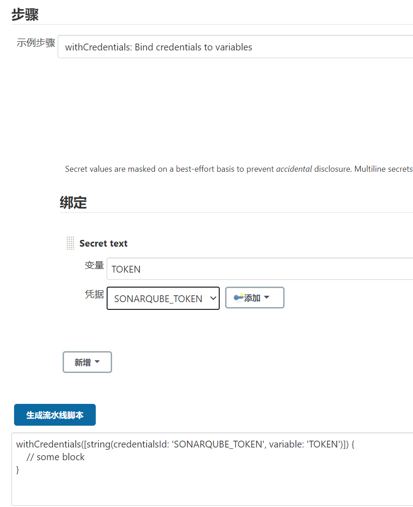
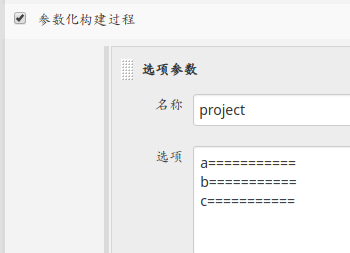
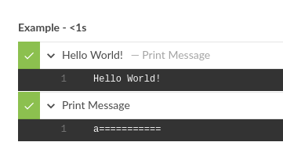
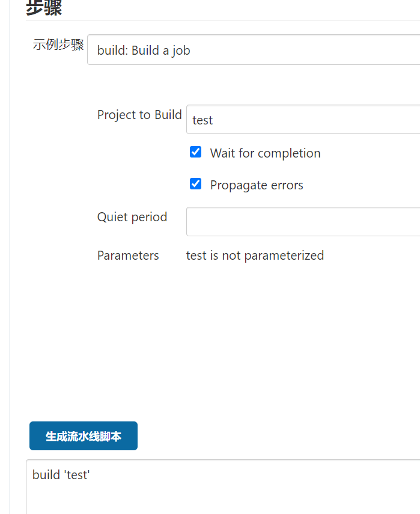
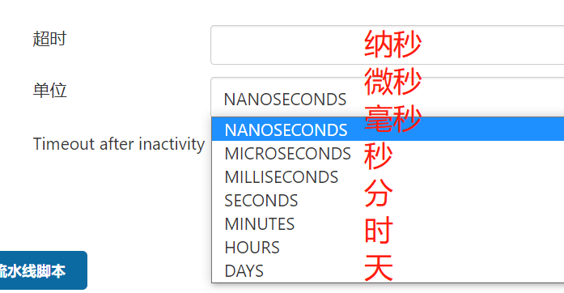
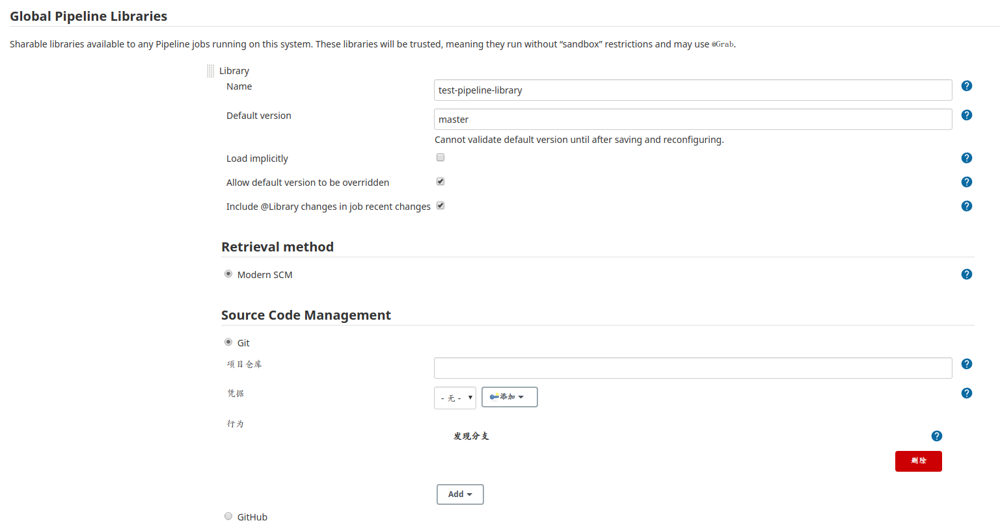
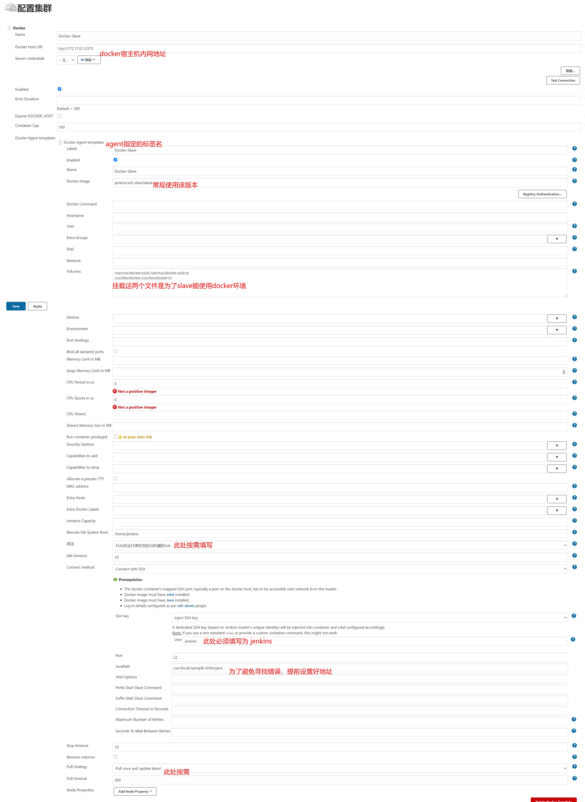
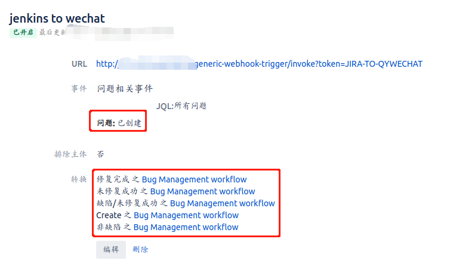
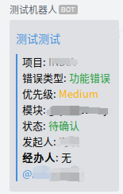

# 1. 简介
本文档重点对pipeline做介绍
## 1. 资料
- 官网: https://www.jenkins.io/
- 文档: https://www.jenkins.io/doc/
- 下载: https://www.jenkins.io/download/
- docker部署文档: https://github.com/jenkinsci/docker/blob/master/README.md
- w3c文档: https://www.w3cschool.cn/jenkins/jenkins-5h3228n2.html
- wiki: https://wiki.jenkins.io/
- 微医devops大佬: https://testerhome.com/cay/topics 讲的非常好我的远逊于他

## 2. 容器化部署
- 基础部署:`docker run -u root -d -e TZ="Asia/Shanghai -v jenkins_home:/var/jenkins_home -p 8080:8080 -p 50000:50000 jenkins/jenkins:lts`
- BlueOcean版jenkins(推荐): `docker run -u root --rm -d -e TZ="Asia/Shanghai -p 8080:8080 -p 50000:50000 -v jenkins_home:/var/jenkins_home -v /var/run/docker.sock:/var/run/docker.sock -v /etc/localtime:/etc/localtime jenkinsci/blueocean`
    - 50000端口: jenkins TCP port for inbound agents默认端口
2. 查看初始token: `docker logs <jenkins的容器>`

## 3. 插件(按需安装)
1. 修改插件源
    - 将插件源改为国内源将会下载更快:插件管理-高级-升级站点
    - 源: `https://mirrors.tuna.tsinghua.edu.cn/jenkins/updates/update-center.json` 

2. `Role-based Authorization Strategy`: 权限矩阵管理
3. `Pipeline Stage View Plugin`: pipeline阶段视图
4. `docker`: 部署slave
5. `SonarQube Scanner for Jenkins`: SonarQube服务端
6. `Sonar Quality Gates Plugin`: Sonar质量阀
7. `Blue Ocean`: 如果安装的非Blue Ocean版 可安装该插件
8. `Credentials Plugin`: 凭证管理
9. `SSH Pipeline Steps`: ssh 
10. `Generic Webhook Trigger`: 通用可配置webhook(可解析)
11. `HTTP Request Plugin`: http请求

# 2. Jenkins pipeline
- 实践: https://testerhome.com/cay/topics

## 1. 概念理解

1. Jenkins Pipeline总体介绍
- Pipeline，简而言之，就是一台运行于Jenkins上的工作流框架，将原本独立运行于单个或者多个节点的任务连接起来，实现单个任务难以完成的复杂流程编排与可视化。
- Pipeline是Jenkins2.X最核心的特性，帮助Jenkins实现从CI到CD与DevOps的转变。
- 详细介绍可见https://jenkins.io/2.0
2. 什么是Jenkins Pipeline
- Jenkins Pipeline是一组插件，让Jenkins可以实现持续交付管道的落地和实施。
- 持续交付管道（CD Pipeline）是将软件从版本控制阶段到交付给用户或客户的完整过程的自动化表现。
- Pipeline提供了一组可扩展的工具，通过Pipeline Domain Specific Language（DSL）syntax可以达到Pipeline as Code的目的
- Pipeline as Code: Jenkinsfile 存储在项目的源代码库
3. Jenkins Pipeline核心概念
- Stage
    - 阶段，一个Pipeline可以划分为若干个Stage，每个Stage代表一组操作，如:“Build”，“Test”， "Deploy"。
    - 注意，Stage是一个逻辑分组的概念，可以跨多个Node。
- Node
    - 节点，一个Node就是一个Jenkins节点，或者是Master，或者是Agent。是执行Step的具体运行环境 。
- Step
    - 步骤，Step是 最基本的操作单元，小到创建一个目录，大到构建一个Docker镜像，由各类 Jenkins Plugin提供，例如:sh 'make'
 
4. 为什么要用Pipeline？
- 代码（Code）: Pipeline以代码的形式实现，通常被检入源代码控制，是团队能够编辑，审查 和迭代其CD流程。
- 可持续性（Durable）:Jenkins重启或者中断后都不会影响Pipeline Job。
- 可停顿（Pausable）:Pipeline可以选择停止并等待人工输入或者批准，然后再继续Pipeline运行。
- 多功能（Versatile）:Pipeline支持实现现实世界的复杂CD要求，包括fork/join子进程，循环和并行执行工作的能力。
- 可拓展（Extensible）:Pipeline插件支持其DSL的自定义扩展及与其他插件集成的多个选项。

## 2. 语法
- https://www.jenkins.io/doc/book/pipeline/syntax/
- https://www.w3cschool.cn/jenkins/jenkins-jg9528pb.html

- 脚本式语法&声明式语法:
    - Scripted Pipeline极大的灵活性和可扩展性,更专业
    - 声明性Pipeline更简单和更有见解的语法,学习曲线更低(官方推荐)

tips: 1. 本笔记只涉略声明式脚本 2. 下面仅介绍一些常用的代码块,更多使用方法可以看上方链接处的语法介绍

### 1. 模板
```groovy
pipeline {
    agent any // 执行者

    stages {
        stage('Build') {  // 阶段
            steps {  // 步骤
                sh 'make' 
            }
        }
        stage('Test'){
            steps {
                sh 'make check'
                junit 'reports/**/*.xml' 
            }
        }
        stage('Deploy') {
            steps {
                sh 'make publish'
            }
        }
    }
}
```

- Pipeline的顶层必须是块，具体来说是:pipeline { }
- 没有分号作为语句分隔符。每个声明必须在自己的一行
- 块只能包含章节， 指令，步骤或赋值语句。
- 属性引用语句被视为无参数方法调用。所以例如，输入被视为input（）
- 可以要()括号 也可以不使用

### 2. 代码块命令
**jenkins自带语法生成器: `http://jenkinsUrl:Port/pipeline-syntax/`**


#### 1. shell命令

```groovy
pipeline {
    agent any
    stages {
        stage('Build') {
            steps {
                sh 'echo "Hello World"' // 执行单条命令
                sh '''
                    echo "Multiline shell steps works too"
                    ls -lah
                '''//执行多条命令
            }
        }
    }
}
```

**也可以进行互相嵌套使用**
```groovy
pipeline {
    agent any
    stages {
        stage('Deploy') {
            steps {
                timeout(time: 3, unit: 'MINUTES') {
                    retry(5) {
                        sh './flakey-deploy.sh'
                    }
                }
            }
        }
    }
}
```

#### 3. post 根据构建状态而执行


```groovy
pipeline {
    agent any
    stages {
        stage('ignore') {
            steps {
                echo "hello_word"
            }
        }
    }
    post { // post部分应放在Pipeline末端
        always {
            echo 'This will always run'
        }
        success {
            echo 'This will run only if successful'
        }
        failure {
            echo 'This will run only if failed'
        }
        unstable {
            echo 'This will run only if the run was marked as unstable'
        }
        changed {
            echo 'This will run only if the state of the Pipeline has changed'
            echo 'For example, if the Pipeline was previously failing but is now successful'
        }
    }   
}
```

- always: 
运行，无论Pipeline运行的完成状态如何。

- changed: 
只有当前Pipeline运行的状态与先前完成的Pipeline的状态不同时，才能运行。

- failure: 
仅当当前Pipeline处于“失败”状态时才运行，通常在Web UI中用红色指示表示。

- success: 
仅当当前Pipeline具有“成功”状态时才运行，通常在具有蓝色或绿色指示的Web UI中表示。

- unstable: 
只有当前Pipeline具有“不稳定”状态，通常由测试失败，代码违例等引起，才能运行。通常在具有黄色指示的Web UI中表示。

- aborted: 
只有当前Pipeline处于“中止”状态时，才会运行，通常是由于Pipeline被手动中止。通常在具有灰色指示的Web UI中表示。


#### 4. agent 代理
以下意思为:启动指定容器并进入执行shell命令
```groovy
pipeline {
    agent none 
    stages {
        stage('Example Build') {
            agent { docker 'maven:3-alpine' } 
            steps {
                echo 'Hello, Maven'
                sh 'mvn --version'
            }
        }
        stage('Example Test') {
            agent { docker 'openjdk:8-jre' } 
            steps {
                echo 'Hello, JDK'
                sh 'java -version'
            }
        }
    }
}
```
- agent none: 在Pipeline顶层定义确保执行者不会被不必要地分配。使用agent none也强制每个stage部分包含自己的agent部分

#### 5. environment 环境变量

```groovy
pipeline {
    agent any

    environment {
        DISABLE_AUTH = 'true'
        DB_ENGINE    = 'sqlite'
    }

    stages {
        stage('Build') {
            steps {
                echo DB_ENGINE
            }
        }
    }
}
```

#### 6. credentials 凭证使用


不同的凭证类型语法上有些许变化，以语法生成器的为准
```groovy
pipeline {
    agent any
    environment {
    // 以下方法仅适用于声明式脚本
    // Secret text
    SONARQUBE_TOKEN = credentials('SONARQUBE_TOKEN')
    // Username with password
    SONARQUBE_ACCESS = credentials('SONARQUBE_ACCESS')
    }
    stages {
        stage('DEMO1') {
            steps {
                // 以下方法仅适用于声明式脚本
                echo ${SONARQUBE_TOKEN}  // 输出token
                echo ${SONARQUBE_ACCESS} // 输出账号和密码
                echo ${SONARQUBE_ACCESS_USR}  // 输出账号
                echo ${SONARQUBE_ACCESS_PSW}  // 输出密码
            }
        }
        stage('DEMO2') {
            steps {
                // 此方法都适用
                withCredentials([string(credentialsId: 'SONARQUBE_TOKEN', variable: 'TOKEN')]) {  // 创建凭证环境
                    echo ${TOKEN}
                }
            }
        }
    }
}

```

#### 7. post 通知

安装相关插件可实现邮件发送或者机器人通知
```groovy
post {
    failure {  // 发送邮件
        mail to: 'team@example.com',  // 送达目标
             subject: "Failed Pipeline: ${currentBuild.fullDisplayName}",  //邮件标题
             body: "Something is wrong with ${env.BUILD_URL}" // 正文内容
    }
}
```

#### 8. input 输入
```groovy
stage('Sanity check') {
    steps {
        input "Does the staging environment look ok?"
    }
}
```

#### 9. globals 全局变量
jenkins自带全局变量文档: `http://jenkinsUrl:Port/job/test/pipeline-syntax/globals`

```groovy
pipeline {
    agent any
    stages {
        stage('Example') {
            steps {
                echo "Running ${env.BUILD_ID} on ${env.JENKINS_URL}"
            }
        }
    }
}
```

ex:
- `env.BUILD_ID`: 当前版本ID
- `env.JOB_NAME`: 构建项目的名称
- `env.JENKINS_URL`: 完整的Jenkins网址(需要在系统配置)

#### 10. checkout 检查scm

```groovy
stage('checkout'){
    steps{
        checkout([$class: 'GitSCM', branches: [[name: '*/master']], doGenerateSubmoduleConfigurations: false, extensions: [], submoduleCfg: [], userRemoteConfigs: [[url: 'https://github.com/foo/foo.git']]])
    }
}
```

#### 11. parameters 参数调用


```groovy
pipeline {
    agent any
    parameters { // 此处参数化在运行一次后会自动出现在 配置页上方的 参数化构建过程
        string(name: 'Greeting', defaultValue: 'Hello', description: 'How should I greet the world?')
        booleanParam(name: 'DEBUG_BUILD', defaultValue: true, description: '')
    }
    stages {
        stage('Example') {
            steps {
                echo "${params.Greeting} World!"
                echo "${params.project}" // 调用参数化构建过程中设定的值
            }
        }
    }
}
```

#### 12. stash存放 & unstash取出
```groovy
```
#### 13. triggers 触发器
```groovy
pipeline {
    agent any
    triggers {
    pollSCM '* * * * *'  //  轮询scm
    cron '* * * * *'  // 定时构建
    upstream 'test' // 其他工程构建后触发
    }
    stages {
        stage('Example') {
            steps {
                echo 'Hello World'
            }
        }
    }
}
```

#### 14. tools 工具指定
通过tools可自动安装工具，并放置环境变量到PATH,工具名称必须在Jenkins的全局工具配置中存在
```groovy
pipeline {
    agent any
    tools {
        sonarscanner 'sonarscanner-01'  // 需要在全局工具配置中设置,且具有多个不同版本的相同工具时使用
    }
    stages {
        stage('Example') {
            steps {
                sh 'sonarscanner'
            }
        }
    }
}
```

#### 15. when 判断

```groovy
pipeline {
    agent any
    stages {
        stage('Example Build') {
            steps {
                echo 'Hello World'
            }
        }
        stage('Example Deploy') {
            when {
                expression { BRANCH_NAME ==~ /(production|staging)/ }
                anyOf {
                    environment name: 'DEPLOY_TO', value: 'production'
                    environment name: 'DEPLOY_TO', value: 'staging'
                }
            }
            steps {
                echo 'Deploying'
            }
        }
    }
}
```
- branch: 
当正在构建的分支与给出的分支模式匹配时执行阶段，例如:`when { branch 'master' }`。请注意，这仅适用于多分支Pipeline。

- environment: 
当指定的环境变量设置为给定值时执行阶段，例如: `when { environment name: 'DEPLOY_TO', value: 'production' }`

- expression: 
当指定的Groovy表达式求值为true时执行阶段，例如: `when { expression { return params.DEBUG_BUILD } }`

- not: 
当嵌套条件为false时执行阶段。必须包含一个条件。例如:`when { not { branch 'master' } }`

- allOf: 
当所有嵌套条件都为真时，执行舞台。必须至少包含一个条件。例如:`when { allOf { branch 'master'; environment name: 'DEPLOY_TO', value: 'production' } }`

- anyOf: 
当至少一个嵌套条件为真时执行舞台。必须至少包含一个条件。例如:`when { anyOf { branch 'master'; branch 'staging' } }`

#### 16. script 支持groovy脚本
支持在声明式脚本中使用复杂的groovy脚本
```groovy
pipeline {
    agent any
    stages {
        stage('Example') {
            steps {
                echo 'Hello World'

                script {
                    def browsers = ['chrome', 'firefox']
                    for (int i = 0; i < browsers.size(); ++i) {
                        echo "Testing the ${browsers[i]} browser"
                    }
                }
            }
        }
    }
}
```

#### 17. parallel 并行执行
```groovy
pipeline {
    agent none
    stages {
        stage('Non-Parallel Stage') {
            steps {
                echo 'This stage will be executed first.'
            }
        }
        stage('Parallel Stage') {
            when {
                branch 'master'
            }
            failFast true  // 以下并行执行 一个失败所有终止
            parallel { // 并行执行
                stage('Branch A') {
                    agent {
                        label "for-branch-a"
                    }
                    steps {
                        echo "On Branch A"
                    }
                }
                stage('Branch B') {
                    agent {
                        label "for-branch-b"
                    }
                    steps {
                        echo "On Branch B"
                    }
                }
                stage('Branch C') {
                    agent {
                        label "for-branch-c"
                    }
                    stages { // 阶段内再嵌套阶段
                        stage('Nested 1') {
                            steps {
                                echo "In stage Nested 1 within Branch C"
                            }
                        }
                        stage('Nested 2') {
                            steps {
                                echo "In stage Nested 2 within Branch C"
                            }
                        }
                    }
                }
            }
        }
    }
}
```

#### 18. build 构建job


```groovy
build 'test'
```

#### 其他
```groovy
sleep 20 // 休息20秒
```

#### 19. options Jenkins Pipeline 配置参数

|参数名|说明|例子|
├──├──├──|
|buildDiscarder|保留最近历史构建记录的数量	|buildDiscarder(logRotator(numToKeepStr: '10')|
|checkoutToSubdirectory	|将代码从版本控制库中拉取后，保存在工作目录的子目录|checkoutToSubdirectory('subdir')|
|disableConcurrentBuilds|禁用Jenkins同时执行多次该pipeline|	disableConcurrentBuilds()|
|newContainerPerStage|agent为Docker或Dockerfile时，每个stage都分别运行在一个新容器中|newContainerPerStage()|
|retry|	pipeline发生失败后重试次数	|retry(4)|
|timeout|pipeline运行超时时间|timeout(time:10, unit: 'HOURS')|

1. timeout超时 & retry重试


```groovy
pipeline {
    agent any
    options { // 全局
        timeout(time: 1, unit: 'HOURS') 
        retry(3)
    }
    stages {
        stage('Deploy') {
            steps {
                retry(3) {  // 代码块内 重试3次
                    sh './flakey-deploy.sh'
                }

                timeout(time: 3, unit: 'MINUTES') {  // 超时时间(3分钟)
                    sh './health-check.sh'
                }
            }
        }
    }
}
```
unit常用选项:
- SECONDS
- MINUTES
- HOURS
- DAYS

## 3. Jenkinsfile
tips: 
1. Jenkinsfile 名字一定要严格区分大小写

### 1. 多分支流水线
1. 通过blueocean新建流水线job
2. 直接创建多分支流水线job

tips: 创建后会自动设置webhook,自动扫描仓库根目录下Jenkinsfile文件

以下仅为示例,非实际上的CICD解决方案
```groovy
#!/usr/bin/env groovy 
pipeline{
    agent none
    parameters {
        choice choices: ['地址1', '地址2', '地址3'], description: '', name: 'git地址'
        // sonarqubescanner = tool 'SonarQubeScanner'
    }
    // tools {
    //     // sonarqubescanner 'SonarQubeScanner'
    // }
    post { // post部分应放在Pipeline末端
        always {
            echo 'This will always run'
            }
        success {
            echo 'This will run only if successful'
            }
        failure {
            echo 'This will run only if failed'
            }
        unstable {
            echo 'This will run only if the run was marked as unstable'
            }
    }
    stages{
        stage('单元测试'){
            steps{
                echo 'unit testing' // 单元测试的结果提供给sonar
            }
        }
        stage('SonarQube静态检查') {
            steps{
                echo "静态检查完成"
            //     withSonarQubeEnv('sonarqube') { //进入sonarqube环境
            //       sh "${sonarqubeScannerHome}/bin/sonar-scanner -Dsonar.projectKey=jenkins -Dsonar.sources=${WORKSPACE}/code/  -Dsonar.host.url=http://172.16.16.84:9000  -Dsonar.login=${token}"
            //     }
            }
        }
        stage("质量阀") {           
            steps{            
                echo "质量阀通过"       
            //     timeout(time: 1, unit: 'HOURS') {// 超时时间1小时                 
            //         waitForQualityGate abortPipeline: true  // 等待 SonarQube 返回的分析结果。当 abortPipeline=true，表示质量不合格，将 pipeline 状态设置为 UNSTABLE。                
            //     }            
            }    
        }
        stage("部署环境"){
            stages{
                stage("开发环境"){
                    when {
                        branch 'dev'
                    }
                    steps {
                        echo "部署开发环境"
                    }
                }
                stage("测试环境"){
                    when {
                        branch 'test'
                    }
                    steps {
                        echo "部署开发环境"
                    }
                }
                stage("生产环境"){
                    when {
                        branch 'pro'
                    }
                    steps {
                        echo "部署开发环境, 请运维人工审批"
                    }
                }
            }
        }
        stage("parallel stage"){
            failFast true
            parallel {
                stage("接口自动化"){
                    agent {
                        label "Docker-Slave"
                    }
                    steps {
                        echo "执行api自动化"
                    }
                }
                stage("组件依赖安全扫描"){
                    agent {
                        label "Docker-Slave"
                    }
                    steps {
                        echo "执行组件依赖安全扫描"
                    }
                }
                stage("UI自动化"){
                    agent {
                        label "Docker-Slave"
                    }
                    steps {
                        echo "执行UI自动化"
                    }
                }   
            }
        }
        stage("人工验收通知"){
            steps{
                echo "生产环境已部署成功,请检查"//也可以将此处合并到post中
            }

        }
    }
}
```


## 4. 共享库shared-libraries
相当于已经创建好的库，在Jenkins 系统设置中设置好后可以进行引包操作。使用库中已经封装好的函数。方便多个pipeline使用，也便于维护。
https://www.jenkins.io/doc/book/pipeline/shared-libraries/

### 设置 shared-libraries
全局库设置(可以添加一个或多个共享库)
- 路径: Manage Jenkins » Configure System » Global Pipeline Libraries


- Name: pipeline中引用library的名字
- Default version: 默认使用的版本
- Load implicitly: 是否默认全局加载,勾选后默认加载,在pipeline script中无需显式引用

### 工程目录结构

```
(root)
+- src                     # Groovy source files
|   +- org
|       +- foo
|           +- Bar.groovy  # for org.foo.Bar class
+- vars
|   +- foo.groovy          # for global 'foo' variable
|   +- foo.txt             # help for 'foo' variable
+- resources               # resource files (external libraries only)
|   +- org
|       +- foo
|           +- bar.json    # static helper data for org.foo.Bar
```
- src目录
    - 标准的Java源目录结构。执行Pipeline时，该目录将添加到类路径中。
    - 存放一些特定的功能实现，文件格式为`.groovy`
- vars目录
    - 存放可从Pipeline访问的全局脚本(标准化脚本),这些脚本文件在流水线中作为公开变量。
    - 每个`.groovy`文件的基本名称应使用驼峰（camelCased）模式，.txt（如果存在）可以包含格式化处理的文档。
    - 在`.groovy`文件中，可以通过`import`的方式，引入src目录的类库
- resources目录
    - 允许libraryResource从外部库中使用步骤来加载相关联的非Groovy文件。目前内部库不支持此功能。

### 使用库
- `library 'my-shared-library'`: 引用my-shared-library的默认版本(推荐)
- `@Library('my-shared-library')_` : 等同于上面的写法(脚本式写法)
- `library 'my-shared-library@master'`: 指定分支版本
---
- `my-shared-library '参数1' '参数2'`: 使用引包的库中的groovy文件(文件中的call方法)(声明式写法 推荐)
- `my-shared-library('参数1', '参数2')`: 等同于上面的写法(脚本式写法)

### 模块库

sayHello.groovy
```groovy
#!/usr/bin/env groovy

def call(String name = 'human') { // call方法相当于main
  echo "Hello, ${name}."
}
```

---
pipeline script
```groovy
@Library('pipeline-library-demo')_  // 此处引用jenkins全局配置中配置的share library  "_"为必须的

stage('Demo') {

  echo 'Hello World'

  sayHello 'Dave' // 直接使用/vars/ 中的文件名
  
}
```

### 模板库
1. 只能放置在`vars/*`中
2. 单个构建只能有一个

pipelineDemo.groovy
```groovy
#!/usr/bin/env groovy

def call(String type,Map map) {
    if (type == "golang") {
        pipeline {
            agent any
            parameters {
                choice(name: 'server',choices:"${map.server}", description: '服务器列表选择')
            }
            stages {
                stage('单元测试') {
                    steps{
                        echo 'unittesting'
                    }
                }
            }
        }
    }
}
```
---
pipeline script
```groovy
library 'pipelineDemo'

def map = [:]  // map类型, 可以理解为python中的字典类型

map.put('server', '192.162.5.1')

pipelineDemo("golang", map)
```


### 其他

#### 1. @NonCPS
`@NonCPS`:
开发jenkins 相关功能的时候很多时候会遇到序列化问题， 这是jenkins内部的机制， 所以有些时候如果你碰到了序列化的异常，那你需要在方法上加入这个注解

#### 2. 全局变量
groovy脚本在需要在声明变量时使用`@Field` 注解声明

#### 3. 第三方库
`@Grab(group = 'org.codehaus.groovy.modules.http-builder', module = 'http-builder', version = '0.7')`: 使用@Grab来引入， 这样groovy语言就可以下载依赖了


### Example
```
share-library
├─ src
├─ vars
│   ├── pipelineTemplate.groovy
│   ├── unitTest.groovy
└─ resource
```

unitTest.groovy
```groovy
#!/usr/bin/env groovy

def call(String server){
    echo 'unittesting...............' + server
    echo server
}

```

pipelineTemplate.groovy
```groovy
#!/usr/bin/env groovy

def call(String type,Map map) {
    if (type == "golang") {
        pipeline {
            agent any
            parameters {
                choice(name: 'server',choices:"${map.server}", description: '服务器列表选择')
            }
            stages {
                stage('单元测试') {
                    steps{
                        unitTest(server) // 可以直接使用同一个package里面的东西
                    }
                }
            }
        }
    }
}

```


# 3. 高可用方案
tips:为了使基于容器运行的slave 有充足的环境支持
1. 自定义slave镜像,在原生slave镜像中整理好环境后,再生成一个镜像
2. 本地挂载
3. 远程挂载(NFS/GlusterFS)

## 1. docker部署 jenkins slave
tips: 安装官方要求master机原则上不build job,所有的job都由slave进行build

官方文档: https://plugins.jenkins.io/docker-plugin/

1. 安装`docker`插件
2. 系统管理→节点管理→Configure Clouds
3. 如下图填写相关参数(填写完docker服务器地址 右侧可以进行连接测试)

4. 创建job，查看job能否创建slave并构建(脚本在下面)

tips: 
1. docker部署的slave每次构建时若无存活slave则会启动新的容器生成新的slave.在构建完成后一小段时间内会自行销毁。
2. 容器会自行销毁但是挂载的其他数据卷则会保留，所以在使用一段时间后应注意占用空间(每次占用极小几k上下)，时间长还是要避免浪费
3. 目标机docker需打开远程访问端口,具体方法可参考docker章节

验证功能是否正常
```groovy
pipeline {
    agent {
        label 'Docker-Slave'
    }
    
    stages {
        stage ('Exec Test Command') {
            steps{
                echo 'Build slave container successful'
                sh 'docker -v'  // 查看slave的docker环境是否正常
                sleep 3
                echo 'Destruction slave container successful'
            }
        }
    }
}
```

## 2. kubernetest 部署 jenkins slave

jenkins 与 k8s 结合,凭借k8s提供水平扩展能力,解决单机性能不足
- 将master和slave都装在k8s之内
- k8s集群中jenkins slave的镜像: jenkins/jnlp-slave
- 同一个pod内所有容器都共享jenkins job的workspace
https://testerhome.com/articles/22280

# 4. 实践
- 自定义通知器: https://www.cnblogs.com/ssgeek/p/12347315.html
- 邮件通知系统: https://testerhome.com/articles/22240

## jira-webhook 集成 企业微信机器人

### 1.jira-webhook配置


- 在URL中填写jenkins提供的webhook接口:`http://JENKINS_URL/generic-webhook-trigger/invoke?token=JIRA-TO-QYWECHAT`
- 为了避免频繁的发送,设定只有在特定的几个转换(步骤)时才发送

### 2.jenkins job



安装如下插件
- `Generic Webhook Trigger`: 通用可配置webhook(可解析)
- `HTTP Request Plugin`: http请求

上述webhook接口中查询字符串的token值为job名

tips: 在初次使用时,需先点击构建,job将进行初始化.之后可正常等待jira通知后构建
```groovy
pipeline {
    agent any
    triggers {
        GenericTrigger (
            causeString: JOB_NAME,  // 事件名跟随job名变动
            genericVariables: [ // defaultValue不可设为 null, jenkins无法识别将报错
                [defaultValue: '无', key: 'SUMMARY', regexpFilter: '', value: '$.issue.fields.summary'], 
                [defaultValue: '无', key: 'PROJECT', regexpFilter: '', value: '$.issue.fields.project.name'], 
                [defaultValue: '无', key: 'ISSUETYPE', regexpFilter: '', value: '$.issue.fields.issuetype.name'], 
                [defaultValue: '无', key: 'PRIORITY', regexpFilter: '', value: '$.issue.fields.priority.name'], 
                [defaultValue: '无', key: 'COMPONENT', regexpFilter: '', value: '$.issue.fields.components[0].name'], 
                [defaultValue: '无', key: 'REPORTER', regexpFilter: '', value: '$.issue.fields.reporter.displayName'], 
                [defaultValue: '无', key: 'ASSIGNEE', regexpFilter: '', value: '$.issue.fields.assignee.displayName'],
                [defaultValue: '无', key: 'PROJECT_KEY', regexpFilter: '', value: '$.issue.fields.project.key'],
                [defaultValue: '无', key: 'KEY', regexpFilter: '', value: '$.issue.key'],
                [defaultValue: '无', key: 'STATUS', regexpFilter: '', value: '$.issue.fields.status.name'],
                [defaultValue: '无', key: 'REPORTER_AT', regexpFilter: '', value: '$.issue.fields.reporter.name'],
                [defaultValue: '无', key: 'ASSIGNEE_AT', regexpFilter: '', value: '$.issue.fields.assignee.name']
                ], 
            printContributedVariables: true,  // 打印捕捉到的参数
            printPostContent: true,  // 打印post方法发送的body
            overrideQuietPeriod: true,
            regexpFilterExpression: '', 
            regexpFilterText: '', 
            token: JOB_NAME,  // token跟随job名字变动,jira钩子处也要变动
            tokenCredentialId: ''
        )
    }
    stages {
        stage('send qywechat') {
            steps {
                script {
                    if(STATUS == "待确认" || STATUS == "重新打开"){
                        AT = '<font color=\\"comment\\">待经办人处理:</font> <@'+ASSIGNEE_AT+'>'
                    }else if(STATUS == "待验证"){
                        AT = '<font color=\\"comment\\">待发起人处理:</font> <@'+REPORTER_AT+'>'
                    }else{
                        AT = '异常状态: <@admin>' // 此处替换成管理员
                    }
                }
                httpRequest (
                    consoleLogResponseBody: true,  
                    contentType: 'APPLICATION_JSON_UTF8', 
                    httpMode: 'POST', 
                    ignoreSslErrors: true, 
                    requestBody: '''{
                        "msgtype": "markdown",
                        "markdown": {
                            "content": "#### ['''+SUMMARY+'''](http://JIRA_URL:PORT/projects/'''+PROJECT_KEY+'''/issues/'''+KEY+''')\\n>项目: <font color=\\"comment\\">'''+PROJECT+'''</font>\\n>错误类型: <font color=\\"info\\">'''+ISSUETYPE+'''</font>\\n>**优先级**: <font color=\\"warning\\">'''+PRIORITY+'''</font>\\n>模块: '''+COMPONENT+'''\\n>状态: <font color=\\"info\\">'''+STATUS+'''</font>\\n>发起人: <font color=\\"comment\\">'''+REPORTER+'''</font>\\n>经办人: <font color=\\"comment\\">'''+ASSIGNEE+'''</font>\\n'''+AT+'''"
                        }
                    }''', 
                    responseHandle: 'NONE', 
                    url: 'https://qyapi.weixin.qq.com/cgi-bin/webhook/send?key=******wechat-robot-key', // 自行替换
                    wrapAsMultipart: false,
                    useSystemProperties: true
                )
            }
        }
    }
}

```
