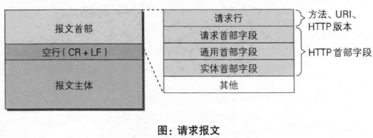

# http 知识点&面试题:
整理收集了相关面试题,以题待学.

1. 说一下什么是Http协议

- 是对客户端和服务器端之间数据传输的格式规范，格式简称为“超文本传输协议”。

2. 什么是Http协议无状态协议?怎么解决Http协议无状态协议?

- 无状态协议对于事务处理没有记忆能力。缺少状态意味着如果后续处理需要前面的信息
- 无状态协议解决办法： 通过 1. Cookie 2.通过Session会话保存。

3. 说一下Http协议中302状态

- http协议中，返回状态码302表示重定向。这种情况下，服务器返回的头部信息中会包含一个 Location字段，内容是重定向到的url

4. Http协议由什么组成?
```http
GET / HTTP/1.1\r\n
Host: localhost:8000\r\n
User-Agent: curl/7.47.0\r\n
Accept: */*\r\n
Content-Length: 16\r\n
Content-Type: application/x-www-form-urlencoed\r\n\r\n
name=123w4234234
```
- 请求报文包括三部分:

    1. 请求行:包含请求方法,URI,HTTP版本协议
    2. 请求首部字段
    3. 请求内容实体
    4. 空行(\r\n)

- 响应报文包含三部分:

    1. 状态行:包含HTTP版本,状态码,状态码原因短语
    2. 响应首部字段
    3. 响应内容实体
    4. 空行(\r\n)

- 通用首部字段（请求报文与响应报文都会使用的首部字段）
    - Date：创建报文时间
    - Connection：连接的管理
    - Cache-Control：缓存的控制
    - Transfer-Encoding：报文主体的传输编码方式

- 请求首部字段（请求报文会使用的首部字段）
    - Host：请求资源所在服务器
    - Accept：可处理的媒体类型
    - Accept-Charset：可接收的字符集
    - Accept-Encoding：可接受的内容编码
    - Accept-Language：可接受的自然语言

- 响应首部字段（响应报文会使用的首部字段）
    - Accept-Ranges：可接受的字节范围
    - Location：令客户端重新定向到的URI
    - Server：HTTP服务器的安装信息

- 实体首部字段（请求报文与响应报文的的实体部分使用的首部字段）
    - Allow：资源可支持的HTTP方法
    - Content-Type：实体主类的类型
    - Content-Encoding：实体主体适用的编码方式
    - Content-Language：实体主体的自然语言
    - Content-Length：实体主体的的字节数
    - Content-Range：实体主体的位置范围，一般用于发出部分请求时使用


5. Http协议中有哪些请求方式?

- GET:用于请求访问已经被URI(统一资源标识符)识别的资源,可以通过URL传参给服务器
- POST:用于传输信息给服务器,主要功能与GET方法类似,但一般推荐使用POST方式
- PUT:传输文件,报文主体中包含文件内容,保存到对应URI位置
- HEAD:获得报文首部,与GET方法类似,只是不返回报文主体,一般用于验证URI是否有效
- DELETE:删除文件,与PUT方法相反,删除对应URI位置的文件
- OPTIONS:查询响应URI支持的HTTP方法

6. Http协议中Http1.0和1.1区别?

    1. 缓存处理 
    2. 带宽优化及网络连接的使用 
    3. 错误通知的管理 
    4. Host头处理(同ip虚拟主机)
    5. 长连接(keep-alive减少客户端频繁的访问服务器)

7. Http协议实现的原理机制

    1. 整个流程步骤:
    
    2. 域名解析过程:
    
    3. 三次握手过程
    4. 发起Http请求
    5. 响应Http请求并得到HTML代码
    6. 浏览器解析HTML代码
    7. 浏览器对页面进行渲染呈现给用户

8. get与post请求的区别?

- 区别一:get重点在从服务器上获取资源,post重点在向服务器发送数据;
- 区别二:get传输数据是通过URL请求(查询字符串),以filed(字段)=value的形式,置于URL后,并用"?"连接,多个请求数据之间用"&"连接,如`http://127.0.0.1/Test/login.action?name=admin&password=admin`，这个过程用户是可见的
- 区别三:get传输量小,因为受URL长度限制,但效率较低;post可以传输大量数据,所以上传文件时只能用post方式
- 区别四:get是不安全的,因为URL是可见的,可能会泄露私密信息,如密码等;post较get安全

9.常见的Http协议状态

- 200：请求被正常处理
- 204：请求被受理但没有资源可以返回
- 206：客户端只是请求资源的一部分，服务器只对请求的部分资源执行GET方法，相应报文中通过Content-Range指定范围的资源。
- 301：永久性重定向
- 302：临时重定向
- 303：与302状态码有相似功能，只是它希望客户端在请求一个URI的时候，能通过GET方法重定向到另一个URI上
- 304：发送附带条件的请求时，条件不满足时返回，与重定向无关
- 307：临时重定向，与302类似，只是强制要求使用POST方法
- 400：请求报文语法有误，服务器无法识别
- 401：请求需要认证
- 403：请求的对应资源禁止被访问
- 404：服务器无法找到对应资源
- 500：服务器内部错误
- 503：服务器正忙

10. Http与Https优缺点?
    1. 通信使用明文不加密,内容可能被窃听,也就是被抓包分析
    2. 不验证通信方身份,可能遭到伪装
    3. 无法验证报文完整性,可能被篡改

Https就是Http加上加密处理(一般是SSL安全通信线路)+认证+完整性保护

11. Http与Https的区别：
HTTP 的URL 以http:// 开头，而HTTPS 的URL 以https:// 开头
HTTP 是不安全的，而 HTTPS 是安全的
HTTP 标准端口是80 ，而 HTTPS 的标准端口是443
在OSI 网络模型中，HTTP工作于应用层，而HTTPS 的安全传输机制工作在传输层
HTTP 无法加密，而HTTPS 对传输的数据进行加密
HTTP无需证书，而HTTPS 需要CA机构wosign的颁发的SSL证书

12. HTTPS工作原理
- 一、首先HTTP请求服务端生成证书，客户端对证书的有效期、合法性、域名是否与请求的域名一致、证书的公钥（RSA加密）等进行校验；
- 二、客户端如果校验通过后，就根据证书的公钥的有效， 生成随机数，随机数使用公钥进行加密（RSA加密）；
- 三、消息体产生的后，对它的摘要进行MD5（或者SHA1）算法加密，此时就得到了RSA签名；
- 四、发送给服务端，此时只有服务端（RSA私钥）能解密。
- 五、解密得到的随机数，再用AES加密，作为密钥（此时的密钥只有客户端和服务端知道）。


11. Http优化

- 利用负载均衡优化和加速HTTP应用
- 利用HTTP Cache来优化网站

12. Http协议有哪些特征?

    1. 支持客户/服务器模式；
    2. 简单快速；
    3. 灵活；
    4. 无连接；
    5. 无状态；

    
14. url&uri
- URI: 统一资源标识符
    - ①访问资源的命名机制
    - ②存放资源的主机名
    - ③资源自身的名称，由路径表示，着重强调于资源。
- URL: 统一资源定位器
    - ①协议(或称为服务方式)
    - ②存有该资源的主机IP地址(有时也包括端口号)
    - ③主机资源的具体地址。如目录和文件名等


### 解析过程

1. 从可读的socket中获取用户发送的请求内容，保存到buf中
```http
GET / HTTP/1.1\r\n
Host: localhost:8000\r\n
User-Agent: curl/7.47.0\r\n
Accept: */*\r\n
Content-Length: 16\r\n
Content-Type: application/x-www-form-urlencoed\r\n\r\n
name=123w4234234
```
- 第一行是request-line
- 最后一行是request-body
- 其余的是request-headers
2. 根据第一个\r\n，buf的内容可以分为两个部分:1. line 2. rbuf
3. 要判断line的长度是否超过了gunicorn配置的limit_request_line参数，超出的话，报错
4. line中是否包含了代理协议
    - 如果包含了，说明真正的request-line包含在rbuf中，如果对rbuf(把rbuf看成buf，进行上述的处理)进行分割
5. line就是合法的request-line，可以解析出：协议、请求的路径、版本号等
6. 可以解析出各个request header， 作为一个list返回即可
    - [('Host','localhost:8000'),('User-Agent','curl/7.47.0'),etc.]