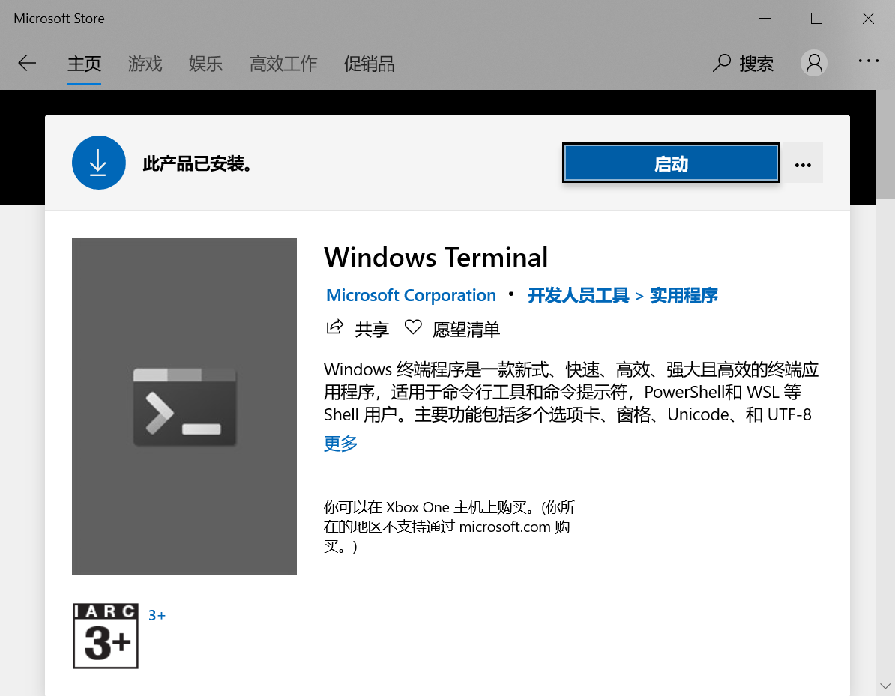

# 修改windows系统文件的权限
原因：使用powershell无法通过私钥访问云服务器，原因是权限too open
解决方案：
- 方案一
1. 点击pem密钥
2. 进入属性
3. 选择 安全
4. 高级
5. 禁止继承
6. 从此对象中删除所有已继承的权限
7. 添加
8. 选择主体
9. 输入系统用户名
10. 检查名称-确定
11. 完全控制
12. 确定
- 方案二
1. `icacls <下载的与云服务器关联的私钥的绝对路径> /grant <用户名>:F`
2. `icacls <下载的与云服务器关联的私钥的绝对路径> /inheritancelevel:r`

# 强行获取app debug权限
- Xposed
- EdXposed

# 为什么测试人员需要懂代码,需要了解开发
1. 严格来说测试人员是要具备代码的思维,从开发思维的角度进行测试收货会更大
2. 更加了解业务,从内到外都了解
3. 在一些不便测试的地方,通过其他手段提供测试
    1. 案例:
    - 需求: 新增符合相关条件跳过人审
    - 问题: 有几项符合条件是由第三方服务提供,而第三方在印度,国内因为墙的原因,频繁访问不到,而此时需要对这几个条件控制变量进行测试
    - 解决: 
        1. 通过之前与开发的沟通,明白开发编写此处需求的编码逻辑:是在请求第三方时等待30秒后通过写入数据库的数据判断第三方结果
        2. 在请求第三方后并等待第三方响应回后,修改数据库数据,使数据达到测试的需要
    2. 案例:
    - 需求: 同上
    - 问题: 第三方返回的状态细分有非常多 上总体可分为 正面状态 负面状态 不确定状态,测试起来特别繁琐
    - 解决: 
        1. 了解开发判断逻辑: 因为正面与负面结果较少,通过绝对匹配只判断正面及负面,其余都归纳为不确定状态
        2. 测试同学可将重心放在分析全部返回状态,看是否有在程序上容易匹配错的项
        3. 重点测试正面和负面,不确定状态抽查

# jetbrains系列使用
https://zhile.io/2020/11/18/jetbrains-eval-reset.html
1. 重置eval时间: pycharm添加源"https://plugins.zhile.io"
2. 搜索`IDE Eval Reset`安装
3. pycharm→help→Eval Reset
4. 可勾选自动执行 → Reset

# win10 系统
## windows terminal

直接在windows store安装即可

## wsl2(Linux的Windows子系统)
https://docs.microsoft.com/zh-cn/windows/wsl/install-win10

vscode 安装 `remote-wsl` 方便开发

### 命令
win端
- `wsl`: 打开wsl
- `wsl -h`: 获取使用说明
- `\\wsl$`: 在文件资源管理器地址栏输入可打开wsl文件资源页

wsl端
- `powershell.exe /c start .`: 打开wsl的资源管理页面

### docker
- 安装完成后需要手动启动: `sudo service docker start`
- wsl不支持使用`systemctl`,所以只能使用`services`
- 需要修改docker仓库地址

# ADB
获取安卓id: `adb shell settings get secure android_id`

# 零散
测试开发一体化，测试思维质量化，质量体系自动化
ownership意识
husky git commit 工具

# gitlab 采用个人令牌 api访问
`curl -X GET -k  -H "Accept:applicaon" -H "PRIVATE-TOKEN:个人令牌" https://gitlab.com/api/v4/user`

环境治理

https://zhuanlan.zhihu.com/p/342087466

# 
在浏览器地址栏输入一个URL后回车，背后会进行哪些技术步骤？ - 小林coding的回答 - 知乎
https://www.zhihu.com/question/34873227/answer/1657140394

测试框架要有一个方向
需要支持什么功能

# 测试框架的设计
由jenkins去实现不同环境的并发测试,框架自身只要提供基于分组的并发即可.类属性用于存公用的数据(比如 token等),类实例属性用于存私用数据(仅用于当前分组)